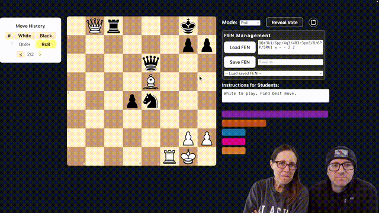

# Chess Club — Backend

This is the backend server for the Chess Club app. It handles real-time communication between the teacher and students using Socket.io.

The frontend (the files your students and teacher actually see) is distributed separately. See the [chess-club-frontend](https://github.com/sergeballif/chess-club-frontend) repo.



---

## What you need

- A free [Render](https://render.com) account
- A place to host static files (any web host works — Google Sites, Netlify, GitHub Pages, your school's server, etc.)

No GitHub account required.

---

## Step 1 — Deploy to Render

1. Go to [render.com](https://render.com) and sign in
2. Click **New → Web Service**
3. Choose **Public Git repository** and paste in this URL:
   ```
   https://github.com/sergeballif/chess-club-backend
   ```
4. Fill in the settings:
   - **Name**: anything you like (e.g. `my-chess-club-backend`)
   - **Branch**: `main`
   - **Runtime**: `Node`
   - **Build Command**: `npm install`
   - **Start Command**: `node index.js`
   - **Instance Type**: `Free`
5. Scroll down to **Environment Variables** and add the following:

   | Key | Value | Required? |
   |-----|-------|-----------|
   | `FRONTEND_ORIGINS` | The URL of your frontend site (e.g. `https://yourschool.com`) | Yes |
   | `TEACHER_PASSWORD` | A password of your choice to protect the teacher controls | Recommended |

   If you're not sure of your frontend URL yet, you can add `FRONTEND_ORIGINS` later.

6. Click **Create Web Service**

Render will build and deploy your server. This takes about a minute.

---

## Step 2 — Note your backend URL

Once deployed, Render shows your service URL at the top of the page. It looks like:

```
https://your-service-name.onrender.com
```

Copy this — you'll need it when setting up the frontend.

---

## Step 3 — Set up the frontend

Follow the instructions in the [chess-club-frontend](https://github.com/sergeballif/chess-club-frontend) repo to download and configure the frontend files.

---

## Updating environment variables later

1. Go to your Web Service on Render
2. Click **Environment** in the left sidebar
3. Update the values and click **Save Changes**
4. Render will automatically redeploy

---

## Free tier note

Render's free tier spins down your server after 15 minutes of inactivity. The first connection after a period of inactivity may take 30–60 seconds. This is normal and expected on the free plan.
